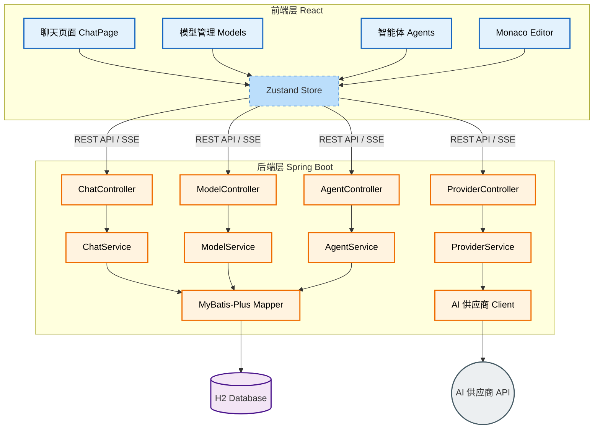

# Open Zen

<div align="center">

**智能体流式交互平台 - 面向代码的 AI Agent 聊天应用**

一个功能完善的 AI 聊天应用，目标是打造成在线聊天 + Code Agent 的应用

[](https://www.oracle.com/java/technologies/javase/jdk21-archive-downloads.html)
[](https://spring.io/projects/spring-boot)
[](https://reactjs.org/)
[](https://www.typescriptlang.org/)
[](LICENSE)

</div>

---

## ✨ 特性

### 🤖 核心功能
- **多供应商管理** - 支持 OpenRouter、OpenAI 等多个 AI 服务供应商
- **灵活的模型配置** - 支持工具调用、视觉输入、推理能力等多种模型特性
- **自定义智能体** - 用户可定义专属的 AI 角色行为和特征
- **流式对话** - 基于 SSE（Server-Sent Events）的流式输出，实时响应
- **代码编辑器** - 集成 Monaco Editor，支持代码模式输入
- **Markdown 渲染** - 支持 GFM、数学公式（KaTeX）和代码高亮

### 💡 高级特性
- **视觉输入** - 支持图片上传和视觉模型对话
- **推理模型支持** - 支持推理模型的思维过程展示
- **会话管理** - 会话分支、复制、重命名、删除
- **消息管理** - 支持从任意消息创建分支会话、删除消息
- **自动标题** - 根据首轮对话自动生成会话标题
- **主题切换** - 支持浅色/深色模式

### 🎯 即将实现
- **工具调用（Function Calling）** - Agent 可调用外部工具和API
- **代码执行** - 在安全沙箱中执行代码
- **文件操作** - 浏览、编辑、创建项目文件
- **终端集成** - 执行命令行操作

---

## 🏗️ 技术架构

### 后端技术栈
- **Java 21** - 使用现代 Java 特性
- **Spring Boot 3.4.1** - Web 框架和依赖注入
- **MyBatis-Plus 3.5.9** - ORM 框架，简化数据库操作
- **H2 Database** - 嵌入式数据库，开箱即用
- **Lombok** - 简化 Java 代码
- **Validation** - 请求参数校验
- **WebClient** - 异步 HTTP 客户端，用于调用 OpenRouter API

### 前端技术栈
- **React 18.3.1** - UI 框架
- **TypeScript 5.6** - 类型安全
- **Vite 6** - 快速构建工具
- **Zustand 5** - 轻量级状态管理
- **React Router 6** - 路由管理
- **Tailwind CSS 3** - 原子化 CSS 框架
- **Monaco Editor** - 代码编辑器（VS Code 内核）
- **React Markdown** - Markdown 渲染
- **KaTeX** - 数学公式渲染

### 系统架构



---

## 🚀 快速开始

### 前置要求
- **Java 21** 或更高版本
- **Node.js 18** 或更高版本
- **Maven 3.8+**
- **OpenRouter API Key**（可在 [OpenRouter](https://openrouter.ai/) 获取）

### 后端启动

1. **进入后端目录**
```bash
cd server
```

2. **编译并运行测试**
```bash
mvn clean test
```

3. **启动应用**
```bash
mvn spring-boot:run
```

后端服务将在 `http://localhost:8080` 启动，H2 数据库自动初始化。

### 前端启动

1. **进入前端目录**
```bash
cd web
```

2. **安装依赖**
```bash
npm install
```

3. **启动开发服务器**
```bash
npm run dev
```

前端应用将在 `http://localhost:5173` 启动。

---

## 📖 使用指南

### 1. 配置供应商
首次使用需要配置 AI 服务供应商：

1. 访问 `/models` 页面
2. 点击"添加供应商"，例如 `OpenRouter`
3. 填写以下信息：
   - 名称：`OpenRouter`
   - API 地址：`https://openrouter.ai/api/v1`
   - API Key：你的 OpenRouter API Key
4. 保存并启用

### 2. 添加模型
配置供应商后，添加你想使用的模型：

1. 在"模型管理"标签页点击"添加模型"
2. 选择供应商：`OpenRouter`
3. 填写模型信息：
   - 模型标识：例如 `qwen/qwen-2.5-coder-32b-instruct`
   - 显示名称：例如 `Qwen 2.5 Coder 32B`
   - 能力：勾选"支持工具调用"、"支持视觉"等
4. 保存并启用


### 3. 创建智能体（可选）
在 `/agents` 页面创建自定义智能体：

1. 点击"创建智能体"
2. 设置名称、描述和系统提示词
3. 选择头像（Emoji 或图片）
4. 保存并启用

**示例：代码助手**
- 名称：`代码助手`
- 系统提示：`你是一个专业的代码助手，擅长多种编程语言和框架。你会提供清晰、简洁的代码示例和最佳实践建议。`

### 4. 开始聊天
访问 `/chat` 页面开始对话：

1. 选择模型（顶部下拉框）
2. 可选择智能体（如已创建）
3. 输入消息或上传图片
4. 享受流式对话体验！

**高级功能：**
- **代码模式**：点击输入框右侧图标切换到 Monaco 编辑器
- **会话分支**：在任意消息旁点击"分支"创建新会话
- **图片输入**：点击图片图标上传图片（需要视觉模型）
- **推理展示**：使用 o1 等推理模型时自动展示思维过程

---

## 🔧 配置说明

### 后端配置
`server/src/main/resources/application.yml`

```yaml
server:
  port: 8080

spring:
  datasource:
    url: jdbc:h2:mem:aiagent  # H2 内存数据库
    driver-class-name: org.h2.Driver
  h2:
    console:
      enabled: true  # 启用 H2 控制台，访问 /h2-console
  sql:
    init:
      mode: always  # 总是执行 schema.sql
      
mybatis-plus:
  configuration:
    map-underscore-to-camel-case: true  # 下划线转驼峰
    log-impl: org.apache.ibatis.logging.stdout.StdOutImpl  # SQL 日志
```

### 前端配置
`web/vite.config.ts`

```typescript
export default defineConfig({
  server: {
    port: 5173,
    proxy: {
      '/api': {
        target: 'http://localhost:8080',  // 后端地址
        changeOrigin: true
      }
    }
  }
})
```

---

## 🧪 测试

项目包含完整的单元测试，覆盖所有核心功能。

### 运行所有测试
```bash
cd server
mvn test
```

### 测试覆盖范围
- ✅ Controller 层测试
- ✅ Service 层测试
- ✅ OpenRouter 客户端测试
- ✅ 工具注册测试

测试报告位于 `server/target/surefire-reports/`

## 🌟 核心功能实现

### 流式对话（SSE）
后端通过 `SseEmitter` 实现流式输出：

```java
@PostMapping("/stream")
public SseEmitter streamChat(@RequestBody ChatSendRequest request) {
    return chatService.streamChat(request);
}
```

前端通过自定义 SSE 解析器接收流式数据：

```typescript
const eventSource = streamChat(sessionId, content, modelId);
eventSource.onmessage = (event) => {
  const data = JSON.parse(event.data);
  if (data.type === 'delta') {
    appendToMessage(data.content);
  }
};
```

### 视觉输入
支持上传图片并发送给视觉模型：

```typescript
// 前端发送
const response = await sendMessage(sessionId, {
  content: "描述这张图片",
  modelId: visionModelId,
  images: ["data:image/jpeg;base64,xxx"]
});

// 后端处理（OpenRouter 格式）
{
  "role": "user",
  "content": [
    {"type": "text", "text": "描述这张图片"},
    {"type": "image_url", "image_url": {"url": "data:image/jpeg;base64,xxx"}}
  ]
}
```

### 推理模型支持
对于 推理模型，单独展示思维过程：

```typescript
// SSE 事件类型
- delta: 正文内容增量
- reasoning: 推理内容增量（折叠展示）
- done: 完成事件
```

### 会话分支
从任意消息创建分支会话：

```java
@PostMapping("/sessions/{sessionId}/branch")
public ChatSession branchSession(
    @PathVariable Long sessionId,
    @RequestBody BranchSessionRequest request
) {
    return chatService.branchFromMessage(sessionId, request.getMessageId());
}
```

---

## 🛣️ Roadmap

### Phase 1: 基础聊天（✅ 已完成）
- [x] 供应商和模型管理
- [x] 基础聊天功能
- [x] 流式输出（SSE）
- [x] Markdown 渲染
- [x] 主题切换

### Phase 2: 高级特性（✅ 已完成）
- [x] 自定义智能体
- [x] 视觉输入
- [x] 推理模型支持
- [x] 会话管理（分支、复制、重命名）
- [x] Monaco 编辑器集成

### Phase 3: Code Agent（🚧 进行中）
- [ ] Function Calling 工具调用
- [ ] 文件系统浏览和操作
- [ ] 代码执行沙箱
- [ ] 终端集成
- [ ] Git 操作支持

### Phase 4: 企业特性（📋 计划中）
- [ ] 多用户支持和权限管理
- [ ] 会话分享和协作
- [ ] 向量数据库集成（RAG）
- [ ] 本地模型支持（Ollama）
- [ ] 插件系统
- [ ] API Key 管理和计费

---

## 🤝 贡献指南

欢迎贡献代码、报告问题或提出建议！

### 开发流程
1. Fork 本仓库
2. 创建特性分支 (`git checkout -b feature/AmazingFeature`)
3. 提交更改 (`git commit -m 'Add some AmazingFeature'`)
4. 推送到分支 (`git push origin feature/AmazingFeature`)
5. 开启 Pull Request

### 代码规范
- 后端：遵循 Java 代码规范，使用 Lombok 简化代码
- 前端：使用 ESLint 和 Prettier，遵循 React 最佳实践
- 提交信息：使用语义化提交（Conventional Commits）

---

## 📄 许可证

本项目采用 [MIT License](LICENSE) 开源协议。

---

## 🙏 致谢

- [OpenRouter](https://openrouter.ai/) - 提供统一的 AI 模型 API
- [Spring Boot](https://spring.io/projects/spring-boot) - 强大的 Java 框架
- [React](https://reactjs.org/) - 现代化的前端框架
- [Monaco Editor](https://microsoft.github.io/monaco-editor/) - VS Code 编辑器内核
- [Tailwind CSS](https://tailwindcss.com/) - 优雅的 CSS 框架

---

## 📮 联系方式

如有问题或建议，欢迎：
- 提交 [Issue](https://github.com/coolerks/open-zen/issues)
- 发起 [Discussion](https://github.com/coolerks/open-zen/discussions)

---

<div align="center">

**⭐ 如果这个项目对你有帮助，请给一个 Star！⭐**

Made with ❤️ by Coolerks

</div>
