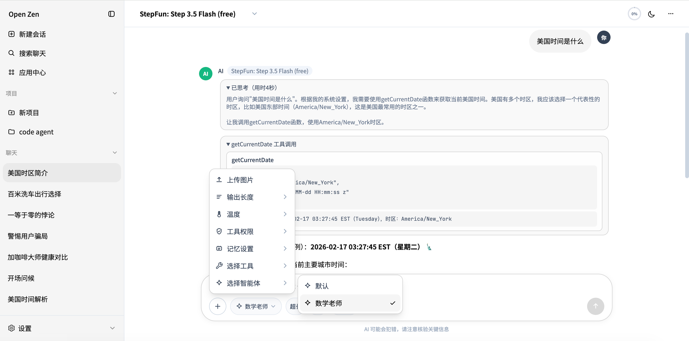
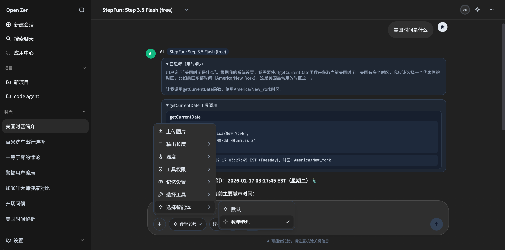
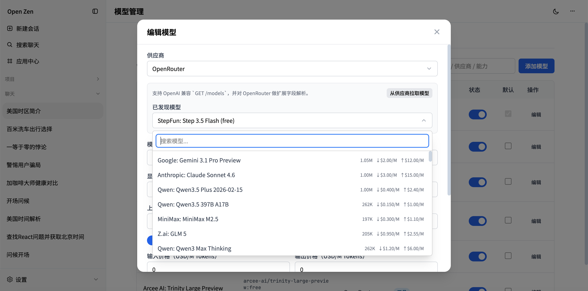
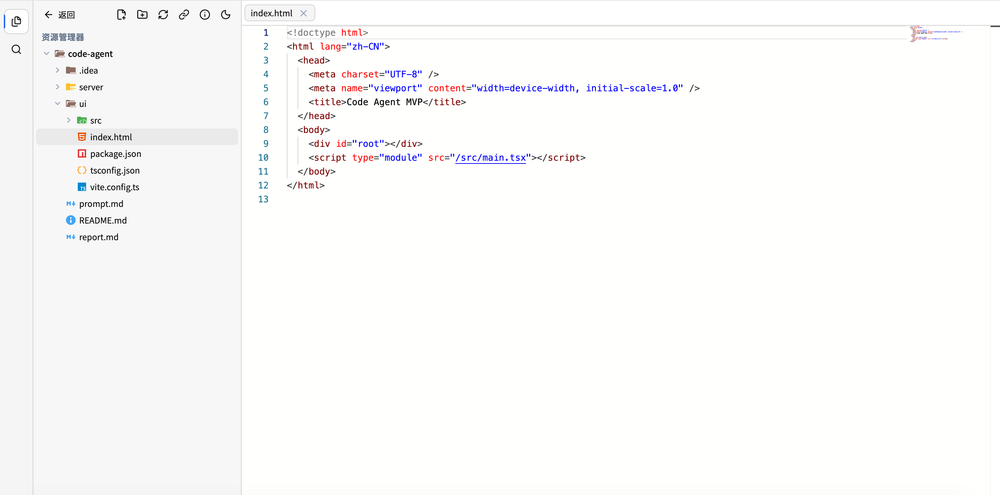
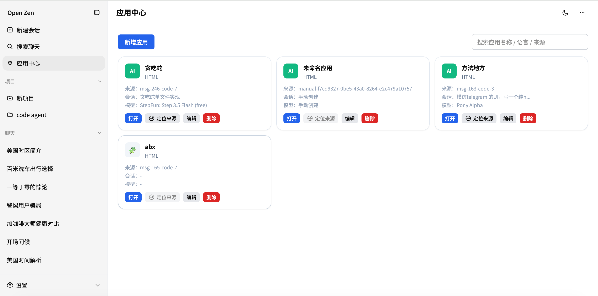

# Open Zen

<div align="center">

**智能体流式交互平台（聊天 + 工具调用 + 应用中心 + 项目中心）**

[](https://www.oracle.com/java/technologies/javase/jdk21-archive-downloads.html)
[](https://spring.io/projects/spring-boot)
[](https://reactjs.org/)
[](https://www.typescriptlang.org/)
[](LICENSE)

</div>

---

## 项目简介

Open Zen 是一个面向 AI Agent 场景的全栈应用，当前已实现：

- 类 ChatGPT 风格的流式聊天体验
- 供应商/模型/智能体管理
- 工具调用（含用户授权流）
- 应用中心（保存 AI 生成代码并复用）
- 项目中心（本地目录资源管理 + 代码预览/对比）

---

## 预览图

### 聊天
| 浅色                             | 深色                             |
| -------------------------------- | --------------------------------- |
|  |  |

### 模型管理



### 项目

后续将支持 Code Agent。



### 应用中心

AI 生成的网页应用可以添加到此处。



---

## 当前功能（与代码实现一致）

### 1. 聊天与会话

- SSE 流式输出（`/api/chat/stream`）
- 推理内容独立展示，支持折叠/展开，显示推理耗时
- Markdown 渲染（GFM）+ KaTeX 公式 + Mermaid 图
- 代码块工具栏：运行 HTML、下载、复制、保存到应用中心
- Mermaid 工具栏：导出 `SVG/PNG/JPEG`、复制 Mermaid 源码
- 图片输入：上传图片 + 粘贴图片
- 会话管理：重命名、复制、删除（含确认）
- 消息管理：删除消息、从某条消息分支会话
- 自动会话标题：首轮对话后独立调用后端生成，失败自动降级
- 会话搜索：支持标题与聊天内容模糊搜索
- 分享会话：复制当前会话链接（`/chat/:sessionId`）
- 导出会话：导出 Markdown、导出 PDF
- 临时聊天：不进入左侧会话列表

### 2. 模型 / 供应商 / 智能体

- 供应商管理：新增、编辑、启停、搜索
- 模型管理：新增、编辑、启停、默认模型、搜索
- 模型自动发现：支持 OpenAI 兼容 `GET /models`，并对 OpenRouter 做增强解析
- 模型能力字段：工具、视觉、推理、上下文窗口、最大输出、价格（含缓存读写）
- 会话模型策略：进入会话默认带出该会话最后一次使用模型；若模型失效自动降级
- 智能体管理：默认智能体 + 自定义智能体，支持提示词、描述、头像（Emoji/图片）
- 消息快照：每条消息记录并展示生成时使用的模型与智能体信息

### 3. 工具调用（Function Calling）

- 工具注册机制：
  - 基于 `ToolDefinition` 的工具定义
  - 基于注解扫描自动注册（`@AiTool` / `@AiToolMethod` / `@AiToolParam` / `@AiToolResult`）
- 内置工具：
  - 时间工具（`getCurrentDate`）
  - 跨会话记忆检索工具（`searchConversationMemory`）
- 工具权限模式：
  - `需要用户授权（默认）`
  - `自动调用工具`
- 用户授权流：
  - 工具调用结果嵌入助手消息展示
  - 可逐条允许/拒绝
  - 未处理授权前阻止继续发送下一条消息
- 会话级工具白名单：
  - 输入框 “+” 菜单可选择本会话允许使用的工具
  - 仅影响当前会话发给模型的工具列表
- 记忆开关：
  - 默认关闭
  - 开启后才向模型暴露记忆工具
  - 临时聊天模式下自动禁用记忆

### 4. 应用中心

- 从聊天代码块一键“添加到应用中心”（同一代码块只能保存一次）
- 保存来源信息：来源会话、来源消息、来源模型
- 支持应用图标（Emoji/图片）、名称编辑
- 内置 Monaco 编辑器编辑应用代码
- 支持查看代码 Diff（与上次保存版本对比）
- 支持“重置代码”（回到 AI 生成的原始代码）
- 支持手动新建应用（直接输入 HTML）
- 支持一键打开应用预览页
- 支持从应用来源跳转回对应会话消息

### 5. 项目中心（Code Agent 基础能力）

- 侧栏项目区：新建项目并关联本地目录（文件夹选择器）
- 项目元数据存储在浏览器（`localStorage` + `IndexedDB`）
- VS Code 风格资源管理器，文件图标来自 Material Icon Theme 素材
- Monaco 代码预览（只读）
- 多标签页：
  - 打开/关闭
  - 拖动重排
  - 右键关闭、关闭其他、全部关闭、向左拆分、向右拆分
- 双栏编辑区：
  - 左右分栏
  - 可拖拽调整宽度
  - 文件可拖放到左栏/右栏打开
- 文件对比：
  - 文件树可多选两项
  - 一键 Diff（Monaco DiffEditor）
- 全局代码搜索（项目模式左侧搜索按钮）：
  - 文件名 + 文件内容搜索
  - 默认遵循项目根目录 `.gitignore`
  - 支持勾选“包含 .gitignore 忽略项”放开限制

---

## 技术栈

### 后端

- Java 21
- Spring Boot 3.4.1
- MyBatis-Plus
- H2（文件库，默认 `./data/aiagent`）
- WebClient
- Jackson

### 前端

- React 18 + TypeScript
- Vite 6
- Zustand
- React Router 6
- Tailwind CSS
- Monaco Editor
- React Markdown + remark-gfm + remark-math + rehype-katex
- Mermaid

---

## 快速开始

### 1) 启动后端

```bash
cd server
mvn clean test
mvn spring-boot:run
```

默认地址：`http://localhost:8080`

### 2) 启动前端

```bash
cd web
npm install
npm run dev
```

默认地址：`http://localhost:5173`

---

## 运行步骤（首次启动）

1. 安装依赖环境：`Java 21+`、`Node.js 18+`、`Maven 3.8+`
2. 启动后端服务：
```bash
cd server
mvn clean test
mvn spring-boot:run
```
3. 启动前端服务（新开一个终端）：
```bash
cd web
npm install
npm run dev
```
4. 打开浏览器访问：`http://localhost:5173/chat`
5. 进入模型管理（`/models`）先配置供应商，再添加可用模型（至少启用 1 个）
6. 返回聊天页开始对话

---

## 路由说明

- 聊天：`/chat`、`/chat/:sessionId`
- 模型管理：`/models`
- 智能体管理：`/agents`
- 应用中心：`/apps`
- 项目中心：`/projects`、`/projects/:projectId`

---

## 关键后端接口

### 聊天

- `GET /api/chat/sessions`
- `GET /api/chat/sessions/search`
- `POST /api/chat/sessions`
- `GET /api/chat/sessions/{id}`
- `PATCH /api/chat/sessions/{id}`
- `DELETE /api/chat/sessions/{id}`
- `POST /api/chat/sessions/{id}/copy`
- `POST /api/chat/sessions/{id}/branch`
- `POST /api/chat/sessions/{id}/auto-title`
- `GET /api/chat/sessions/{id}/messages`
- `DELETE /api/chat/sessions/{sessionId}/messages/{messageId}`
- `POST /api/chat/sessions/{sessionId}/tool-approval`
- `GET /api/chat/sessions/{id}/context`
- `GET /api/chat/tools`
- `POST /api/chat/send`
- `POST /api/chat/stream`

### 供应商/模型/智能体/应用

- 供应商：`/api/providers/*`
- 模型：`/api/models/*`（含 `/api/models/discover`）
- 智能体：`/api/agents/*`
- 应用中心：`/api/apps/*`

---

## 配置说明

后端配置文件：`server/src/main/resources/application.yml`

当前默认配置重点：

- 端口：`8080`
- 数据库：`jdbc:h2:file:./data/aiagent;AUTO_SERVER=TRUE`
- H2 控制台：`/h2-console`
- 启动执行 `schema.sql`

数据库 DDL 与注释：`server/src/main/resources/schema.sql`

---

## 工具扩展示例

项目已支持注解方式扩展工具，核心注解位于：

- `com.aiagent.service.tool.annotation.AiTool`
- `com.aiagent.service.tool.annotation.AiToolMethod`
- `com.aiagent.service.tool.annotation.AiToolParam`
- `com.aiagent.service.tool.annotation.AiToolResult`

内置扫描器：`ToolAnnotationScanner`  
注册中心：`ToolRegistry`

---

## 已知约束

- 项目中心依赖浏览器 File System Access API，建议使用 Chromium 内核浏览器。
- 项目中心当前定位为“代码浏览/对比”，不直接回写本地文件。
- 大体量仓库搜索会受浏览器性能限制，已内置结果数和文件大小保护阈值。

---

## 相关文档

- 迭代记录：`docs/功能迭代说明.md`
- 提示与约束：`prompt.md`

---

## 许可证

[MIT](LICENSE)
